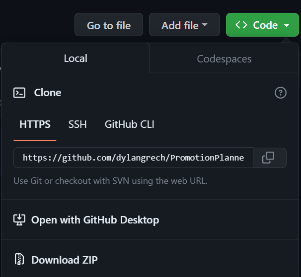

<h1>Installation Guide for the Promotion Planner Module</h1>
<h3>First Step:</h3>

Firstly, navigate to the OXID Eshop you want to install this module on. Make sure it is the correct shop you want to install this module on.

<h2>Composer Installation</h2>
<h3>Second Step (Composer Installation):</h3>

Afterwards type in the following in the command log:

<code>  composer require pp/PromotionPlanner </code>

Installation through Composer should now be complete.

<h2>Manual Installation</h2>
<h3>Second Step (Manual Installation):</h3>

If you press on the green code button you can download the whole content as a zip file.

<h3>OR</h3>

Write the following command in the Terminal/Command Log:

<code>git clone https://github.com/dylangrech/PromotionPlannerModule</code>
<h3>Third Step (Manual Installation):</h3>

As soon as you download the module, make sure to unzip or open the folder. Make sure to copy the pp folder

Afterwards paste the folder in the modules folder found in source/modules

<h3>Fourth Step (Manual Installation):</h3>

Lastly, as soon as you have copied the content, type in the following commands in the terminal(make sure you are in the oxid eshop of your choice):

Each command has to be executed one at a time

<code>
vendor/bin/oe-console oe:module:install-configuration source/modules/pp/PromotionPlanner
composer config repositories.pp/PromotionPlanner path source/modules/pp/PromotionPlanner
composer require pp/PromotionPlanner -n
</code>
<h2>Congrats Module Setup has been finished. If there are any problems please do not hesitate to contact me!</h2>
